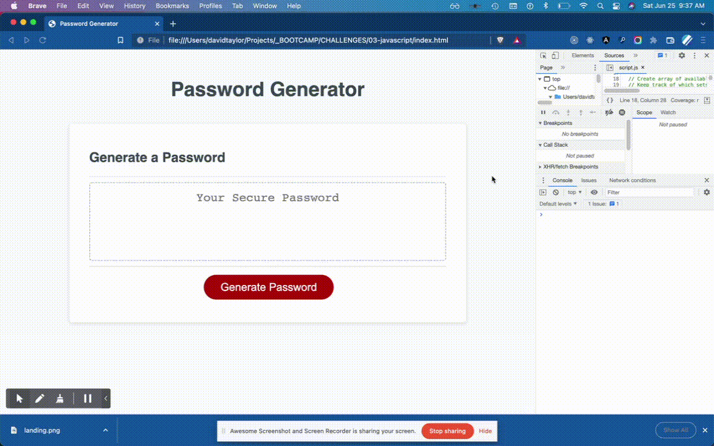

<!-- @format -->

# Challenge - 03 JavaScript: Password Generator

## Create a password based on your input

Ask the user which types of characters to include and a password length.

- special characters, upper case letters, lower case letters, numbers
- length of 8 - 128

```
  // Collect input from user
  const useSpecialChars = confirm('Use special characters? (cancel for no)')
  const useUpperCase = confirm('Use upper case letters? (cancel for no)')
  const useLowerCase = confirm('Use lower case letters? (cancel for no)')
  const useDigit = confirm('Use numbers? (cancel for no)')
  let length = Number(prompt('Password length (8 to 128)'))

  // Create array of available characters
  // Keep track of which sets are included
  const availableChars = [];
  const availableMsg = [];
  if (useSpecialChars) { //Repeated for each character set
    availableChars.push(...specialChars)
    availableMsg.push('special characters')
  }
```

## Enforce minimum requirements

A password is not generated unless input meets requirements

- At least one set of characters is selected
- length is greater than 8 and less than 128

```
  // If no available characters display error and break
  if (availableChars.length === 0) {
    message.textContent = "You must include at least one set of characters"
    return ''
  } else message.textContent = ""

  // If length is invalid ask user for valid input
  while (!length || length < 8 || length > 128) {
    length = Number(prompt('INVALID. Please enter a password length between 8 and 128'))
  }
```

## Generate password

The password is generated using an array of all available characters.

- incremental increase by 1 while password is less than the length
- generate a message using innerHtml
- return password || returns '' if there is an error, allowing placeholder to display

```
  const specialChars = ` !"#$%&'()*+,-.\/:;<=>?@\[\\\]^_\`{|}~`.split('')
  const upperCase = `ABCDEFGHIJKLMNOPQRSTUVWXYZ`.split('')
  const lowerCase = `abcdefghijklmnopqrstuvwxyz`.split('')
  const digit = `0123456789`.split('')

  // Generate pw incrementally with random characters
  let pw = ''
  while (pw.length < length) {
    pw += availableChars[Math.floor(Math.random() * availableChars.length)]
  }

  // Generate a message for the user
  message.innerHTML = `Using: ${availableMsg.join(', ')}<br>Length: ${length}`

  return pw;
```


